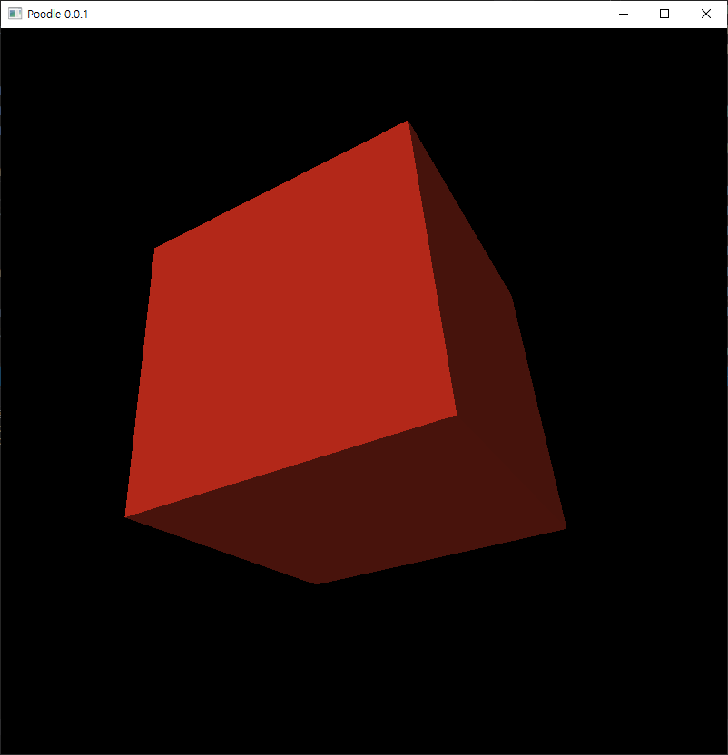

Rendering engine using native C++ and modern openGL.

## Platform

- Windows 10 Desktop [Visual Studio 2019]

## Build

- Set `Client` as startup project.
- Go to Configuration Properties &#8594; Debugging &#8594; Environment and type `PATH=%PATH%;../ThirdParty/bin/Debug`.

## License

See <a href="https://github.com/Twin-Monkeys/Poodle/blob/master/LICENSE">LICENSE</a>.

This project has some third-party dependencies, each of which may have independent licensing:

- <a href="https://github.com/Dav1dde/glad">glad</a>: GL/GLES/EGL/GLX/WGL Loader-Generator based on the official specs 
- <a href="https://github.com/glfw/glfw">glfw</a>: A multi-platform library for OpenGL, OpenGL ES, Vulkan, window and input
- <a href="https://github.com/g-truc/glm">glm</a>: OpenGL Mathematics
- <a href="https://github.com/KhronosGroup/glslang">glslang</a>: Shader front end and validator
- <a href="https://github.com/nothings/stb">stb</a>: Single-file public domain (or MIT licensed) libraries
- <a href="https://github.com/assimp/assimp">assimp</a>: A library to import and export various 3d-model-formats including scene-post-processing to generate missing render data

## Demo

<kbd></kbd>
<kbd></kbd>
